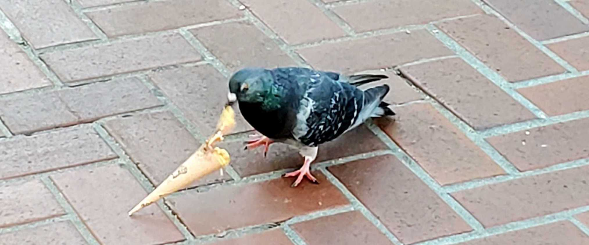

## 👋 Hi there! I'm Angel Chen 👋 

💬 <b>Pronouns</b>: she/her

💻 <b> Personal website</b>: [angelchen7.github.io](https://angelchen7.github.io/)

I'm a data scientist for the [Malone Disturbance Ecology Lab](https://www.malonelab.org/) at Yale School of the Environment. In short, I help develop reproducible workflows to wrangle, harmonize, analyze, and visualize ecological datasets. I'm interested in learning about the best practices for reproducible, open science. In my spare time, I like to watch birds 🐦

*Pigeon eating an ice cream cone, downtown San Francisco*

### 📝 Experience
- 2024 - Present: Data Scientist for Malone Disturbance Ecology Lab
- 2022 - 2024: Data Analyst for LTER working groups
- 2019 - 2022: Data Curator for NCEAS Arctic Data Center

### 📖 Education
- 2021: Bachelor of Science in Statistics & Data Science from UC Santa Barbara
